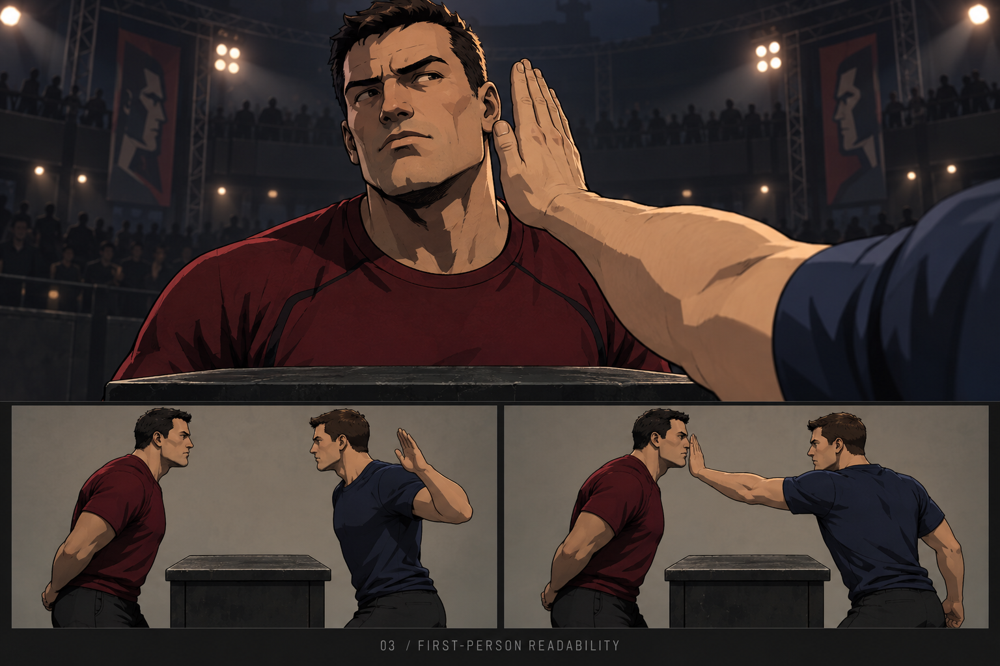

# BACKENBEBEN

Ein experimentelles 3D-Slap-Fighting-Spiel für private LAN-Duelle im Browser.
Godot rendert die Arena; ein lokaler Python-Host verwaltet Regeln, Physik und Matches.
Der Look orientiert sich an kantiger Comicgrafik und dem ursprünglichen XIII.

## Aktueller Stand

Prototyp 02 funktioniert technisch: Training, LAN-Duell, Handkontakt, Gewebeverformung,
Replay, diegetische Verletzungen, Emotes und lokales Balancing. **Das Spielgefühl und
die räumliche Verständlichkeit sind noch nicht zufriedenstellend.** Der nächste Schritt
ist eine neue Figur mit körpergebundenem Arm gemäß dem [Asset-Gauntlet V3](docs/ASSET_GAUNTLET_V3.txt).
Die Konzeptbilder zeigen das Ziel, nicht den bereits erreichten Spielzustand.

## Spielen unter Windows

1. Das Host-Paket aus den [Releases](https://github.com/r0bsta1909/backenbeben/releases) entpacken.
2. Python 3.12 installieren, falls noch nicht vorhanden.
3. `SETUP_HOST.bat` einmal ausführen: installiert nur die Host-Abhängigkeiten in `.venv`.
4. `START_HOST.bat` starten. Der Browser öffnet sich, das Terminal zeigt die LAN-Adresse.
5. Gäste öffnen diese Adresse im selben Netzwerk. Kein Python beim Gast nötig.

Das Paket enthält den fertigen Webbuild. Der normale Git-Checkout enthält die editierbaren
Quellen; vor dem Spielen daraus den Webbuild erstellen. Der Host bindet das lokale Netzwerk,
nicht für öffentliche Internetbereitstellung gedacht. Windows-Firewall ggf. für das private
Netzwerk freigeben; `ALLOW_LAN.bat` richtet eine begrenzte Regel für Port 8765 ein.

[Steuerung und Host-Befehle](SPIELEN.txt) · [Technische Tests](docs/GAUNTLET.txt)

## Entwickeln

- Godot 4.7.2 Compatibility Renderer + passende Web-Exportvorlagen.
- Blender 4.5.14 LTS für reproduzierbare Assets und editierbare `.blend`-Quellen.
- Python 3.12; Abhängigkeiten in `server/requirements.txt` und `tests/requirements.txt`.
- Lokale Portable-Tools sind absichtlich nicht in Git. Verzeichnislayout: [Toolchain](docs/TOOLCHAIN.txt).
- `BUILD_GAME.bat` exportiert `game/` nach `build/web/`.
- `scripts/create_assets.py` reproduziert den Prototyp-02-Assetstand.
- `python -m unittest discover -s tests -p "test_*.py"` prüft Regeln und Physik.
- Aktuelle Integrationstests: `tests/v2_browser_gauntlet.py` und `tests/v2_network_gauntlet.py`
  gegen einen separaten Host auf Port 8877. Playwright und Chrome werden dafür benötigt.

## Wissenssicherung

Beginne bei [HANDOFF](docs/HANDOFF.txt): Produktziel, Nutzerfeedback, Architektur,
Entscheidungen, bekannte Grenzen, nächster konkreter Arbeitsschritt und GitHub-Workflow.
Weitere Referenzen: [Konzept](docs/KONZEPT.txt), [Backlog](docs/BACKLOG.txt),
[Art Direction und Prompts](docs/art-direction-v3/PROMPTS.txt), [Assetvertrag](docs/ASSETS.txt).

Fremde Referenzfotos/-screenshots, lokale Konfiguration, Zugangsdaten, Laufzeitdownloads
und rohe Matchlogs werden nicht veröffentlicht. Die neuen Konzeptbilder wurden mit
Imagegen erzeugt. Lizenzhinweise für den mitgelieferten Godot-Webruntime stehen unter
`third-party/`. Für eigene Projektinhalte wurde bisher keine zusätzliche Lizenz gewählt.
