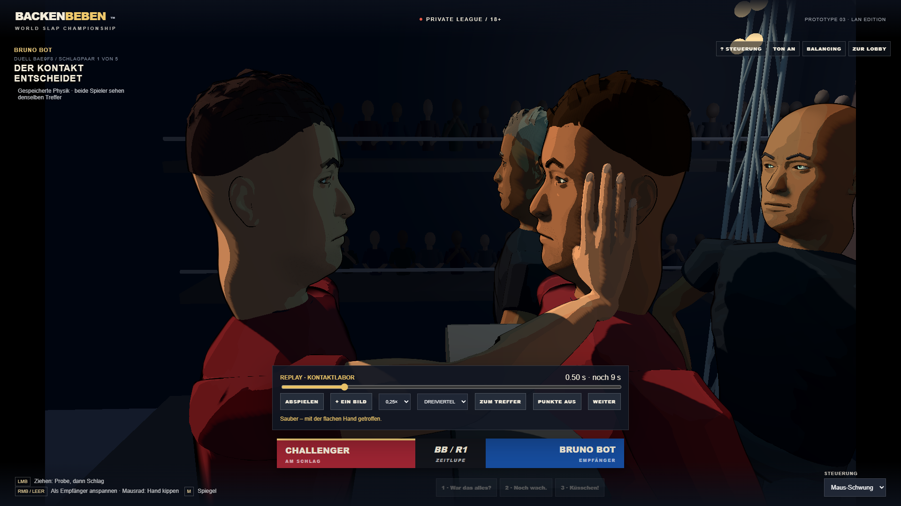

# BACKENBEBEN

Ein experimentelles 3D-Slap-Fighting-Spiel für private LAN-Duelle im Browser.
Godot rendert die Arena; ein lokaler Python-Host verwaltet Regeln, Physik und Matches.
Der Look orientiert sich an kantiger Comicgrafik und dem ursprünglichen XIII.

## Aktueller Stand

Der aktuelle [Prototyp 05](https://github.com/r0bsta1909/backenbeben/releases/tag/v0.5.0-dev.20261008)
enthält anatomische Arm-/Handmodelle, körpergebundene seitliche Schläge und vom Host
aufgezeichnete Kontakt-/Gesichtsreplays. Weitere schadensfreie Probeschwünge sind
wählbar; Verletzungen und geschwollene Augen erscheinen auch im eigenen Spiegel.

Standardkampf, KO, Replay-Rücklauf, Wiedereinstieg und Revanche sind mit zwei
Browserclients geprüft. Das Hostpaket wurde außerhalb des Projekts mit frischer
Python-Umgebung getestet und der GitHub-Download per SHA256 abgeglichen.
Zwei Browserclients auf einem PC ersetzen keinen Test auf zwei physischen PCs.

**Experimenteller Stand, keine fertige Stil- oder Spielgefühlsabnahme.** Die letzte
menschliche Rückmeldung war „weiterhin unverständlich“; eine neue Abnahme steht aus.
Kopf/Kiefer, Wertung und KO verwenden teilweise vereinfachte Modelle. Der
[aktuelle Abnahmestand](docs/PROTOTYPE_STATUS.txt) und der
[verbindliche Gauntlet](docs/PROTOTYPE_GAUNTLET.txt) nennen die offenen Anforderungen.
Die [Konzeptbilder](docs/art-direction-v3/03-first-person.png) bleiben das Stilziel.

## Spielen unter Windows

1. Das Host-Paket aus den [Releases](https://github.com/r0bsta1909/backenbeben/releases) entpacken.
2. Python 3.12 installieren, falls noch nicht vorhanden.
3. `SETUP_HOST.bat` einmal ausführen: installiert nur die Host-Abhängigkeiten in `.venv`.
4. `START_HOST.bat` starten. Der Browser öffnet sich, das Terminal zeigt die LAN-Adresse.
5. Gäste öffnen diese Adresse im selben Netzwerk. Kein Python beim Gast nötig.

Das Paket enthält den fertigen Webbuild. Der normale Git-Checkout enthält die editierbaren
Quellen; vor dem Spielen daraus den Webbuild erstellen. Der Host bindet das lokale Netzwerk,
nicht für öffentliche Internetbereitstellung gedacht. Windows-Firewall ggf. für das private
Netzwerk freigeben; `ALLOW_LAN.bat` richtet eine begrenzte Regel für Port 8765 ein.

[Steuerung und Host-Befehle](SPIELEN.txt) · [Technische Tests](docs/GAUNTLET.txt)

## Entwickeln

- Godot 4.7.2 Compatibility Renderer + passende Web-Exportvorlagen.
- Blender 4.5.14 LTS für reproduzierbare Assets und editierbare `.blend`-Quellen.
- Python 3.12; Abhängigkeiten in `server/requirements.txt` und `tests/requirements.txt`.
- Lokale Portable-Tools sind absichtlich nicht in Git. Verzeichnislayout: [Toolchain](docs/TOOLCHAIN.txt).
- `BUILD_GAME.bat` exportiert `game/` nach `build/web/`.
- `scripts/create_character_v3.py` erzeugt die neue editierbare Blender-Figur und GLB.
- `python server/arm.py` erzeugt acht Prüfclips; `game/asset_lab.tscn` zeigt sie.
- `scripts/create_assets.py` erhält den historischen Prototyp-02-Assetstand.
- `python -m unittest discover -s tests -p "test_*.py"` prüft Regeln und Physik.
- Aktuelle Integrationstests: `tests/v3_browser_gauntlet.py` und `tests/v3_network_gauntlet.py`
  gegen einen separaten Host auf Port 8877. Playwright und Chrome werden dafür benötigt.

Der normale Hoststart verwendet den gekoppelten Kontaktpfad. Für einen separaten
Testhost:
`python server/host.py --port 8877 --no-browser --no-console --physics coupled`
Nach einem Update einmal `SETUP_HOST.bat` ausführen; die benötigte Kompilierung
ist jetzt in `server/requirements.txt` enthalten.
Er liefert vollständige Browser-Replays mit seitlichem Gewebe und durchgehender
Arm-Rückholung. Die Rechenworker werden beim Hoststart vorbereitet; der geprüfte Browser-Treffer
benötigte danach rund 1,36 Sekunden. Kopf/Kiefer bleiben eine stilisierte Reaktion. `--physics legacy` hält den bisherigen Pfad für technische Vergleiche verfügbar.
Der gezielte Browsercheck
lautet `python tests/replay_contact_view.py --expect-coupled --visual-contact`.

## Wissenssicherung

Beginne bei [HANDOFF](docs/HANDOFF.txt): Produktziel, Nutzerfeedback, Architektur,
Entscheidungen, bekannte Grenzen, nächster konkreter Arbeitsschritt und GitHub-Workflow.
Weitere Referenzen: [Konzept](docs/KONZEPT.txt), [Backlog](docs/BACKLOG.txt),
[Art Direction und Prompts](docs/art-direction-v3/PROMPTS.txt), [Assetvertrag](docs/ASSETS.txt).

Fremde Referenzfotos/-screenshots, lokale Konfiguration, Zugangsdaten, Laufzeitdownloads
und rohe Matchlogs werden nicht veröffentlicht. Die neuen Konzeptbilder wurden mit
Imagegen erzeugt. Lizenzhinweise für den mitgelieferten Godot-Webruntime stehen unter
`third-party/`. Kopf, Arme und Hände verwenden in Blender angepasste CC0-Topologie von
MakeHuman; Quelldaten und Herkunft liegen unter `assets-source/makehuman/`. Für eigene Projektinhalte wurde bisher keine zusätzliche Lizenz gewählt.

Die Kontaktwertung verwendet inzwischen 116 aus der sichtbaren Hand exportierte
Oberflächenpunkte. [Geometrieprüfung, Integration und Grenzen](docs/HAND_CONTACT_SURFACE.txt).
